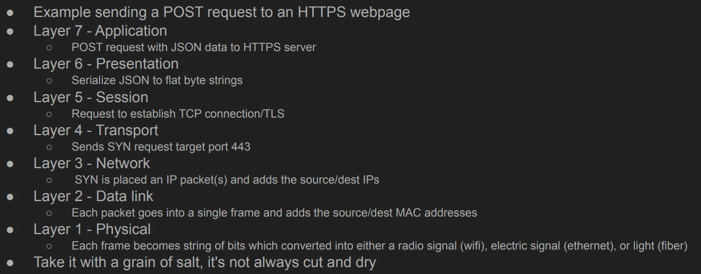
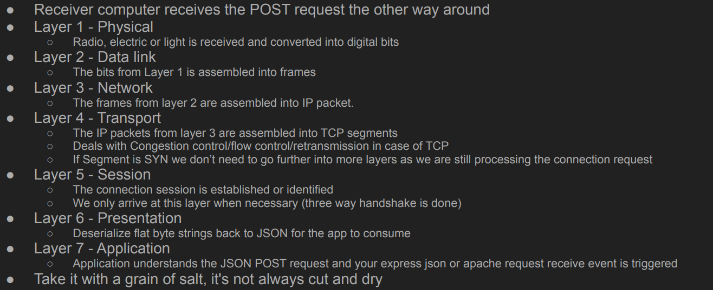
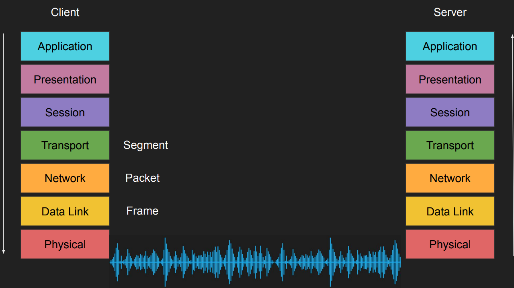
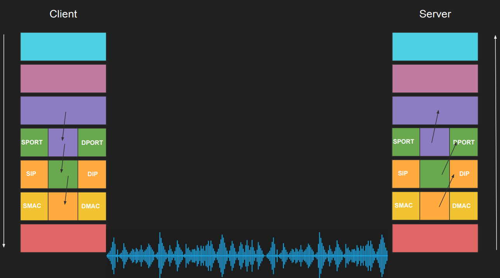
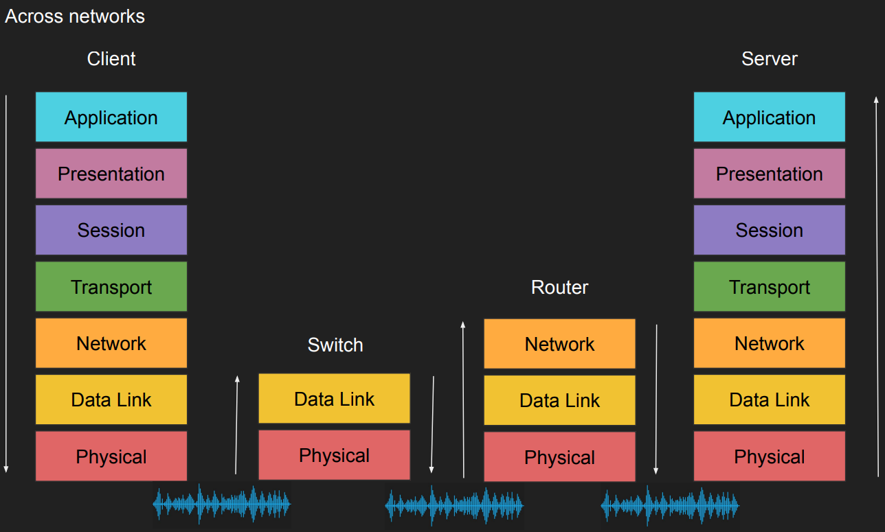

# Client - Server Architecture

### Why?
1. Machines are expensive, applications are complex
2. Seperate the application into two components
3. Expensive workload can be done on the server
4. Clients call servers to perform expensive tasks
5. REmote Procedure call (RPC) was born

### Benefits?
1. Servers have beefy hardware
2. Cleints have commodity hardware
3. Clients can still perform lightweight tasks
4. Clients no longer require dependencies
5. However, we need a communication model

## OSI Model (Open Systems Interconnection Model)
> Any SW engineer should understand this model as long as you keep interacting with networking
### Why OSI Model?
1. Agonstic application
> Apps must not have knowlege of the underlying network medium.  
> Imaginge that there should be app version for each network interface!!!
2. Network equipment management
> without a standard model, upgrading network equipments becomes difficult.

### A) what is the OSI model?
> 7 layers each describes a specific networking component
1. Layer 7 - Application - HTTP/FTP/gRPC
> there might be protocols on top of HTTP like OCPP and that considered application. (state-less protocol)
2. Layer 6 - Presentation - Encoding, Serialization
> the object being sent shall be converted to a string. (it's being done for you for granted)
3. Layer 5 - Session - Connection establishment, TLS
> it's a state-ful protocol as it stores a state on both server and client sides. (termination) 
4. Layer 4 - Transport - UDP(Data gram)/TCP(segment)/MQTT
> it's a transffer protocol that cares about the states of packet transfer whether reaches or not (there is visibility to ports)
5. Layer 3 - Network - IP (packets)
> Cares about sending a packet to a specific IP (doesn't care about the packet transfer states, and no visibility to ports)
6. Layer 2 - Data link - (Frames) Mac address Ethernet
> framing the whole data composed with the MAC address of the network interface and its type
7. Layer 1 - Physical - Electric signals, fiber or radio waves
> this is the baremetal look of the data Zero's  One's

### OSI model - an example (Sender)

### OSI model - an example (Receiver)

### Client sends an HTTPS POST request (graphically)

### B) TCP/IP model
> Much simpler than OSI just 4 layers
1. Application (layer 5, 6, and 7)
2. Transport (layer 4)
3. Internet (layer 3)
4. Data link (layer 2)
5. Physical layer isn't officially coverd in the model
